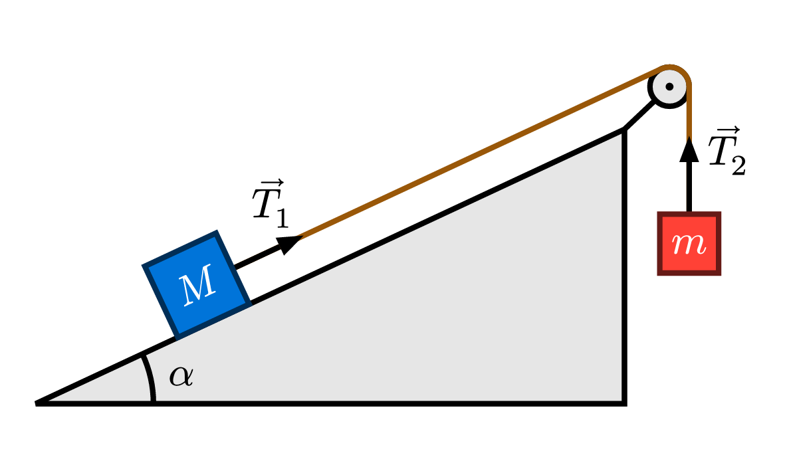

# patatrac
With this [Typst](https://typst.app) package drawing physics diagrams is faster than ever! No cumbersome trigonometry required! Get started with the introductory [`tutorial`](https://github.com/ZaninDavide/patatrac/blob/main/docs.pdf).

    

